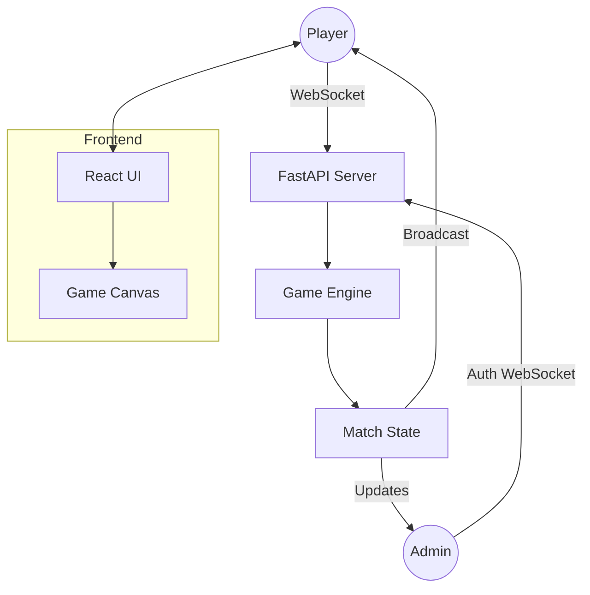

# 🎮 Battle Royale: Ember Deathmatch

[English](README.md) | [繁體中文](README.zh-TW.md)


## 🌌 Project Overview
**Battle Royale** is a high-performance, real-time multiplayer combat simulator designed for seamless web-based gameplay. Built with a focus on low-latency interactions and robust administrative control, it offers a "Continuous Deathmatch" experience where players can jump in, choose their arsenal, and battle against both humans and AI-driven bots.

---

## 🚀 Key Features

- **⚡ Real-Time Combat**: Powered by high-frequency WebSocket communication for smooth movement and projectile tracking.
- **🤖 Advanced Bot AI**: Intelligent automated opponents that populate the arena, providing a constant challenge even in low-player environments.
- **🛡️ God-Mode Admin Panel**: A comprehensive dashboard for real-time game management (respawn control, HP modification, game timers, and bot orchestration).
- **🔫 Dynamic Arsenal**: Multiple weapon types (Pistol, SMG, Shotgun, Sniper, etc.) with unique fire rates, damage profiles, and projectile behaviors.
- **📱 Responsive Controls**: Full support for both Desktop (Keyboard/Mouse) and Mobile (On-screen Joysticks).
- **📖 Integrated Documentation**: Built-in multi-language technical documentation accessible directly through the game interface.

---

## 🛠️ Technology Stack

### Backend (The Brain)
- **FastAPI**: A modern, high-performance Python framework for the core API and WebSocket management.
- **AsyncIO**: Handles non-blocking game loops and concurrent player connections.
- **Game Engine**: A custom-built Python engine managing spatial partitioning, collision detection, and match state.

### Frontend (The Visuals)
- **React + Vite**: For a lightning-fast UI and efficient component lifecycle management.
- **HTML5 Canvas**: High-performance 2D rendering for the game arena and effects.
- **React Router**: Manages seamless navigation between the Game, Admin Panel, and Documentation.

### DevOps & Deployment
- **Docker**: Containerized environment for consistent deployment across local and cloud environments (Railway, AWS, etc.).
- **MkDocs**: Secondary technical documentation site generation.

---

## 🏗️ Project Architecture



---

## 🚦 Getting Started

### Prerequisites
- Python 3.10+
- Node.js 18+
- Docker (Optional)

### Local Development Setup

#### 1. Backend Setup
```bash
cd backend
python -m venv venv
source venv/bin/activate  # Windows: venv\Scripts\activate
pip install -r requirements.txt
python main.py
```

#### 2. Frontend Setup
```bash
cd frontend
npm install
npm run dev
```

---

## 🐳 Docker Deployment

The project is fully containerized for easy deployment.

```bash
# Build the image
docker build -t battle-royale .

# Run the container
docker run -p 8000:8000 battle-royale
```
The game will be accessible at `http://localhost:8000`.

---

## 🔐 Administration

To access the Admin Panel, navigate to `/admin` and enter the administrative password (configured in the backend settings).

**Capabilities:**
- **Player Management**: Force respawn, kill, or adjust HP of specific players.
- **Match Control**: Reset matches, end games, or adjust the global match timer.
- **Bot Orchestration**: Toggle bots on/off and adjust their difficulty/count.
- **System Settings**: Modify game constants like respawn penalties and base HP.

---

## 📄 Documentation

The project includes two forms of documentation:
1. **In-Game Docs**: Accessible at `/docs`, providing gameplay guides and system overviews in multiple languages.
2. **Technical Docs**: Generated via MkDocs (see `mkdocs.yml`) for deep architectural insights.

---

## 📜 License
This project is licensed under the MIT License. See the LICENSE file for details.
