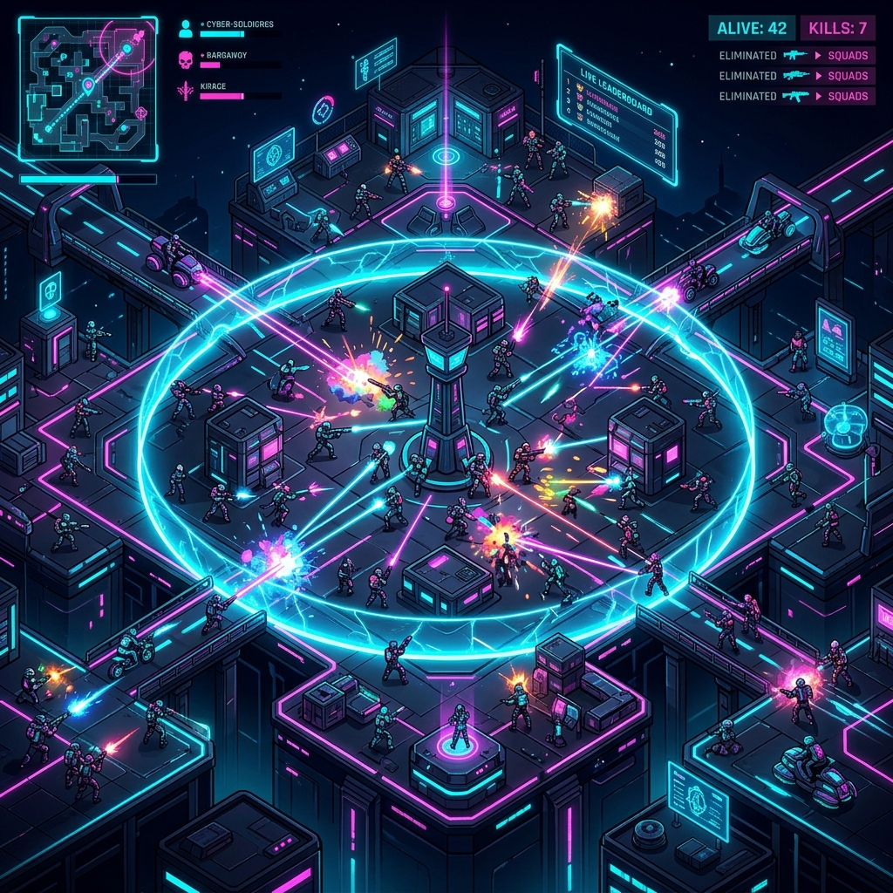
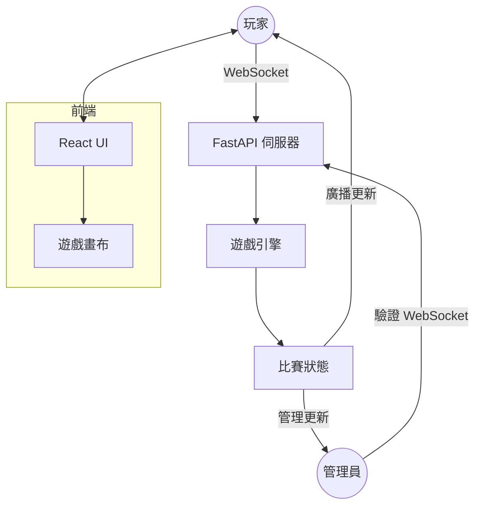

# 🎮 Battle Royale: 競技場 ● 餘燼協定

[English](README.md) | [繁體中文](README.zh-TW.md)



## 🌌 專案概述
**Battle Royale** 是一款高效能、即時的多人戰鬥模擬器，專為流暢的網頁遊戲體驗而設計。本專案專注於低延遲互動與強大的管理控制，提供「持續大亂鬥」的遊戲體驗，玩家可以隨時加入、選擇武器，並與其他玩家或 AI 機器人展開對決。

---

## 🚀 核心功能

- **⚡ 即時戰鬥**: 透過高頻率 WebSocket 通訊，實現流暢的人物移動與彈道追蹤。
- **🤖 進階機器人 AI**: 具備智能的自動對手，確保在玩家較少時依然充滿挑戰性。
- **🛡️ 上帝模式管理面板**: 全方位的即時遊戲管理後台（包含重生控制、HP 修改、遊戲計時器及機器人編排）。
- **🔫 動態武器系統**: 多種武器類型（手槍、衝鋒槍、散彈槍、狙擊槍等），每種武器都有獨特的射速、傷害數值與子彈行為。
- **📱 響應式控制**: 完整支援電腦（鍵盤/滑鼠）與行動裝置（螢幕虛擬搖桿）。
- **📖 整合式文件**: 內建多國語言技術文件，可直接從遊戲介面存取。

---

## 🛠️ 技術棧

### 後端 (核心邏輯)
- **FastAPI**: 現代、高效能的 Python 框架，用於核心 API 與 WebSocket 管理。
- **AsyncIO**: 處理非阻塞遊戲迴圈與併發玩家連接。
- **遊戲引擎 (Game Engine)**: 自定義 Python 引擎，管理空間分割、碰撞偵測與賽事狀態。

### 前端 (視覺呈現)
- **React + Vite**: 打造閃電般的 UI 體驗與高效的組件生命週期管理。
- **HTML5 Canvas**: 用於遊戲場景與特效的高效能 2D 渲染。
- **React Router**: 管理遊戲、管理面板與文件之間的無縫導航。

### 運維與部署
- **Docker**: 容器化環境，確保在本地與雲端環境（如 Railway, AWS）的一致性。
- **MkDocs**: 用於生成深層架構洞察的技術文件網站。

---

## 🏗️ 專案架構



---

## 🚦 快速上手

### 系統需求
- Python 3.10+
- Node.js 18+
- Docker (選配)

### 本地開發設置

#### 1. 後端設置
```bash
cd backend
python -m venv venv
source venv/bin/activate  # Windows 環境: venv\Scripts\activate
pip install -r requirements.txt
python main.py
```

#### 2. 前端設置
```bash
cd frontend
npm install
npm run dev
```

---

## 🐳 Docker 部署

本專案已完全容器化，方便快速部署。

```bash
# 建立映像檔
docker build -t battle-royale .

# 執行容器
docker run -p 8000:8000 battle-royale
```
遊戲將可透過 `http://localhost:8000` 存取。

---

## 🔐 遊戲管理

若要存取管理面板，請導航至 `/admin` 並輸入後端設定的管理員密碼。

**管理權限包含：**
- **玩家管理**: 強制重生、擊殺或調整特定玩家的 HP。
- **賽事控制**: 重設比賽、立即結束遊戲或調整全球比賽計時器。
- **機器人編排**: 切換機器人開關並調整其難度與數量。
- **系統設置**: 修改遊戲常數，如重生懲罰與基礎 HP。

---

## 📄 技術文件

本專案包含兩種形式的文件：
1. **內建文件**: 可在遊戲中透過 `/docs` 存取，提供多語言的遊戲指南與系統概覽。
2. **技術文件**: 透過 MkDocs 生成（詳見 `mkdocs.yml`），提供深層的架構說明。

---

## 📜 授權協議
本專案採用 MIT 授權協議。詳情請參閱 LICENSE 檔案。

---
*Developed with ❤️ by the Antigravity Team.*
